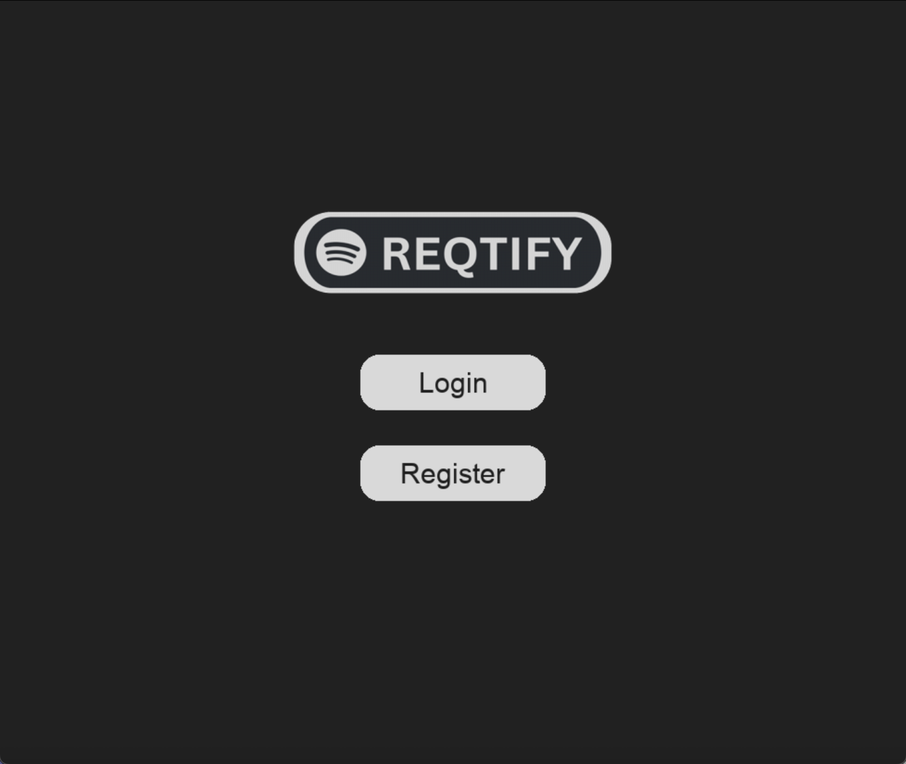
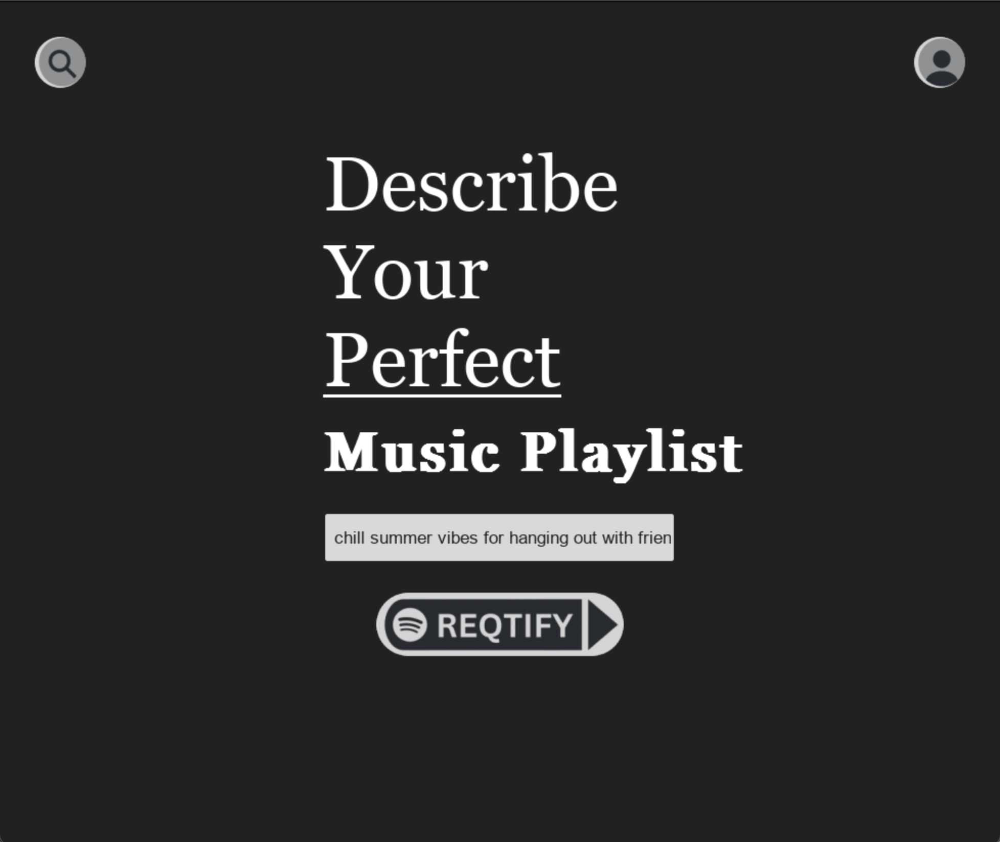
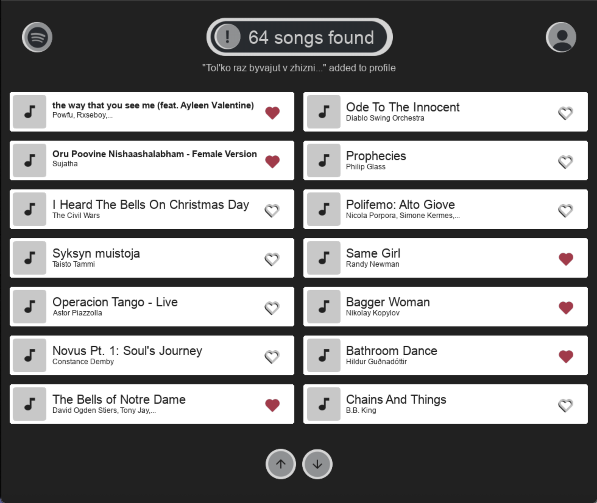
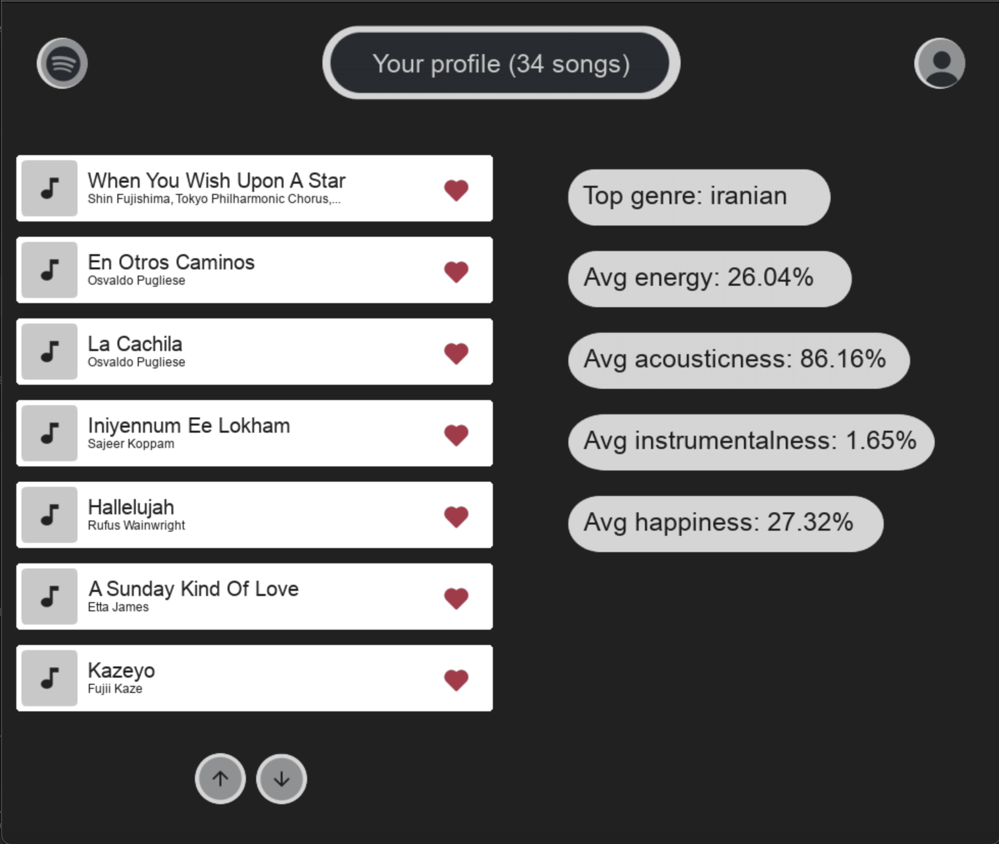
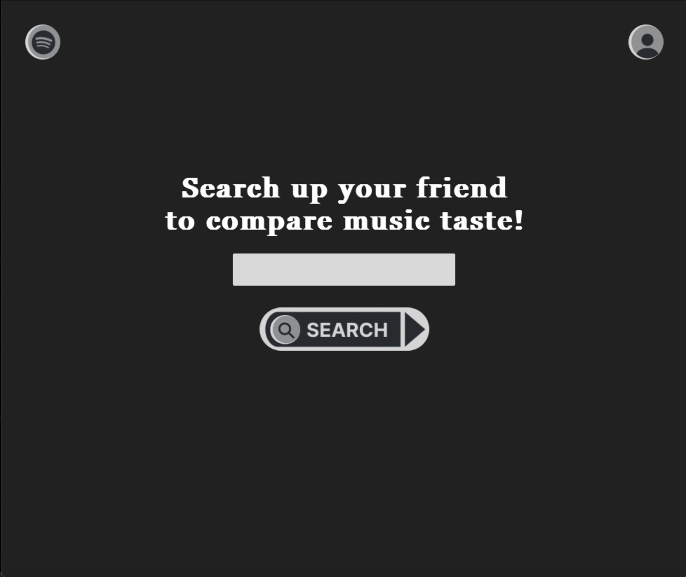
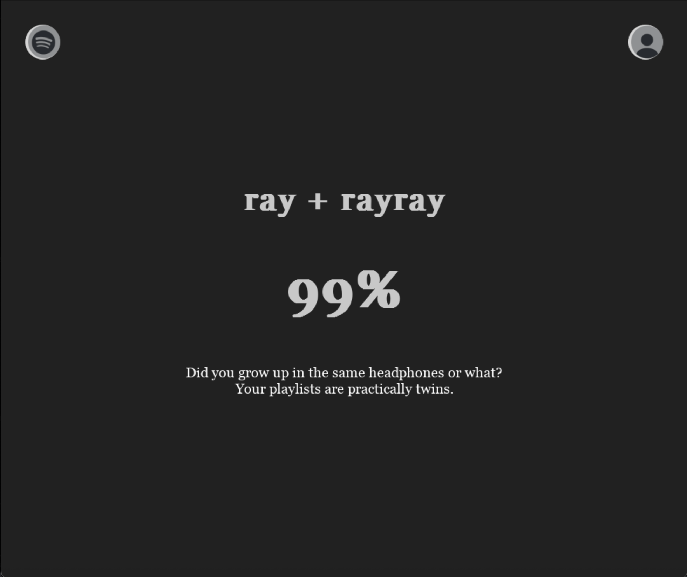

# Reqtify 🎧

Reqtify is an Object-Oriented Python music recommendation engine that curates the perfect playlist based on your exact mood or scenario. Just type in a prompt, and let the algorithm do the heavy lifting to find the right tracks for you.

## 🚀 Features

* **Prompt-Based Playlist Generation:** Describe your perfect vibe (e.g., *"chill summer vibes for hanging out with friends"*) and get a custom-tailored list of songs.
* **Smart Recommendation Engine:** Under the hood, Reqtify utilizes **Natural Language Processing (NLP)** for sentiment analysis to interpret your prompt. It then passes these values through a **Decision Tree** algorithm to map your mood to the perfect audio characteristics.
* **Data Analytics & User Profiles:** Save your favorite generated songs to your personal profile. The app extracts audio features to calculate your musical DNA, including your Top Genre, Average Energy, Acousticness, Instrumentalness, and Happiness.
* **Algorithmic Taste Matching:** Search for your friends' profiles and compare your music tastes. The app uses similarity scoring to calculate a compatibility percentage, letting you know if your playlists are practically twins!

## 📸 Screenshots

| Title Screen | Prompt Search |
| :---: | :---: |
|  |  |

| Results Page | User Profile & Stats |
| :---: | :---: |
|  |  |

| Friend Search | Compatibility Match |
| :---: | :---: |
|  |  |

## 🧠 How It Works

1. **Input:** You provide a natural language prompt describing the kind of music you want to hear.
2. **Text Processing:** The app uses NLP techniques to break down your prompt and extract core sentiment values.
3. **Content-Based Filtering:** Using a custom-built decision tree, the app filters through a comprehensive music dataset, matching the derived sentiment values against the specific audio features of the tracks (like energy, acousticness, and valence).
4. **Output:** A curated list of songs that perfectly match the vibe you asked for.

## 🛠️ Tech Stack & Architecture

* **Language:** Python
* **Architecture:** Object-Oriented Programming (OOP)
* **Core Concepts:** Machine Learning (Decision Trees), Natural Language Processing (Sentiment Analysis), Content-Based Recommendation Systems, Data Analytics

## 💻 Installation and Setup

1. Clone the repository:
   ```bash
   git clone [https://github.com/yourusername/reqtify.git](https://github.com/yourusername/reqtify.git)
   ```
2. Navigate to the project directory:
   ```bash
   cd reqtify
   ```
3. Install the required dependencies:
   ```bash
   pip install -r requirements.txt
   ```
4. Run the application:
   ```bash
   python main.py
   ```
